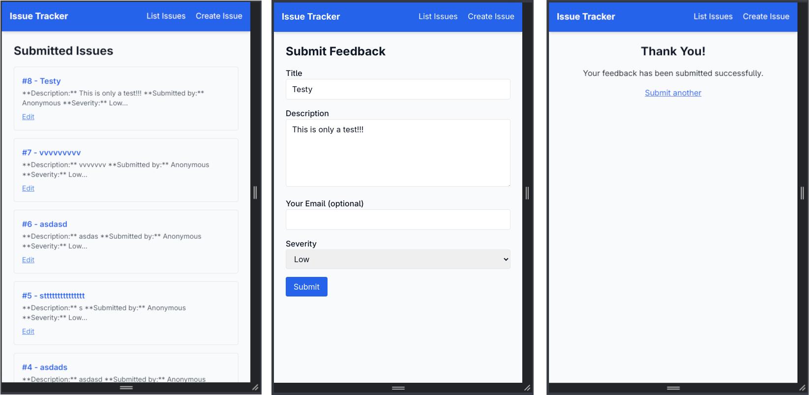

# Client-Facing Bug/Feedback Tracker (Python MVP)

## Overview
Lightweight web app that allows non-technical users to submit bug reports and feedback via a form. Submissions are turned into GitHub issues via the GitHub REST API.

## Tech Stack
- **Backend**: FastAPI (Python)
- **Frontend**: HTML + Tailwind CSS (via CDN)
- **Templates**: Jinja2
- **HTTP Client**: httpx

```

## User Flow
